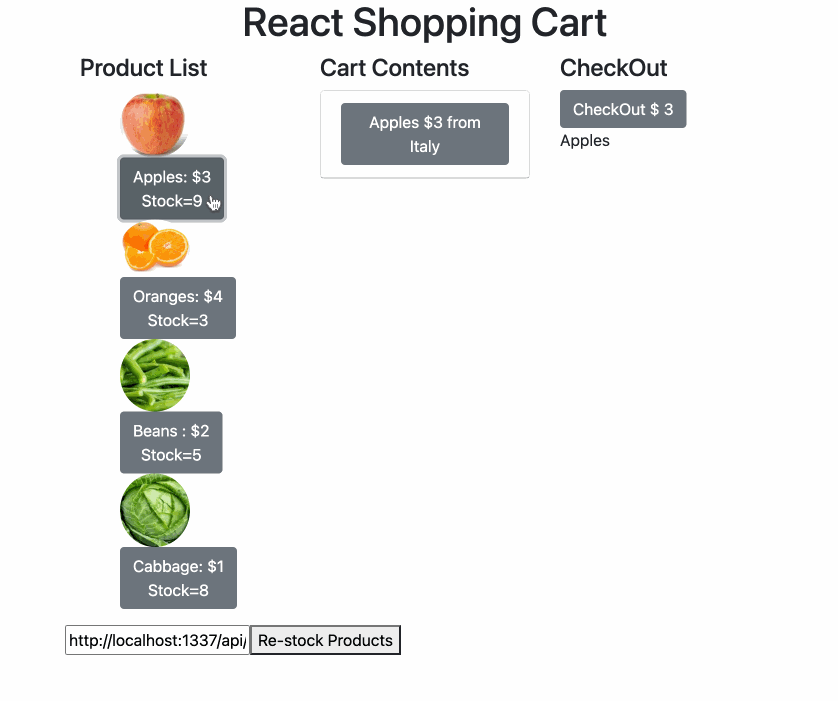

# shopping_cart
This Shopping cart project was completed by using REACT with following features.
- Users can add, remove, and check-out list of the items.
- Users can re-stock items if wanted.
- This Program will render APIs using "strapi". 
- styling was done using bootstrap.

# How to run
- Create a directory to hold your strapi DB.
- Open a terminal at the directory you just created and run following command:
% npx creat-strapi-app NameOfTheFile --quickstart
- After installation is completed, sign-up browser window will popup,
if not direct to http://localhost:1337/admin/auth/register-admin on your browser and Sign-up.
- Go to the Content-Types Builder on the left and then create a new collection type.
- Input product as the display name for the collection.
- Select Text for the field type.
- Type in name as the product name and then click the + Add another field button.
- Create country (name), cost (number integer), and instock (integer).
- Save everything and click on the role & permission under the setting section.
- Find products roles and select all to change to public.
-navigate back to the Products collection and select the Draft button on each of them and then for each item, select the Publish button at the top right

